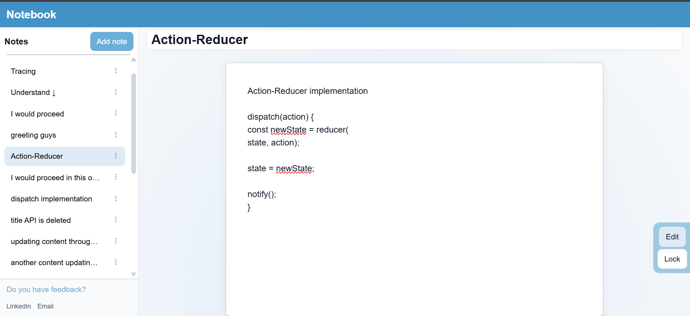
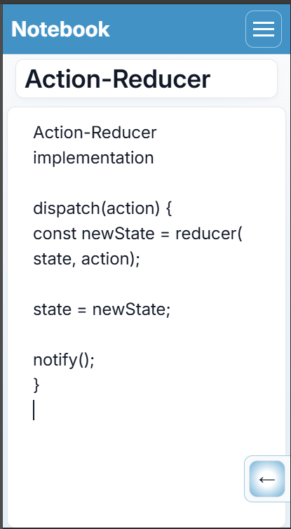

# Notebook App

[](https://github.com/teshomedev/notebook-app/actions)

A simple note-taking app built with vanilla JavaScript - no frameworks, no dependencies.

**Live Demo:**  [Notebook app](https://teshomedev.github.io/notebook-app/)

The goal of this project is:
- to learn the architectural patterns that modern frameworks and libraries hide.
- to develop engineering judgement, trade-offs and execution workflow.

<p align="center">
  
  
</p>

## Features
- Edit and persist contents
- Toolbar to switch between edit and read-only mode
- Sidebar - for note navigation
- Hamburger menu - to show and hide sidebar
- Title editor - used to update titles
- Content editor - enables to edit and paste
contents
- Save on debounce

## Testing
76 tests passing (unit and integration)

## Architecture
See [docs/ARCHITECTURE.md](./docs/ARCHITECTURE.md) for:
- Full folder structure
- Module responsibilities
- Communication patterns

*Design System*
- Tokens
- Components

*Modules Communication*
- Event-driven Pub/Sub
- Domain-driven

*ES6+ Modules*
- State
- Domain
- Use cases
- Services
- Side effects
- Events
- UI
- Utilities
- Unit tests

## Tech
HTML • CSS3 • Vanilla JavaScript(ES6+) •  localStorage • vitest

## Future Architecture Progress
- [x] A single gatetway mutation
- [x] Appy subscription
- [x] State change publication
- [x] Tighten data validation boundary guard
- [x] Ensure modules decoupled
- [x] Add accessibility
- [x] Add unit test files
- [x] Add integration test
- [x] Add CI/CD
- [ ] Add end-to-end test
- [ ] Add filter feature
- [ ] Add search feature
- [ ] Add Undo feature

## What I learned
- Three categories of data in a software system - *constant*, *state* and *derived*
- Boundaries between modules
- Single responsibility of components and modules
- State ownership - no state mutations outside state module
- Folder organization - separating source codes, documentation and dependencies
- How to make a web accessible to all
- Working with vitest and node to add unit and integration tests
- Automated workflow tests


## Who can use it
- Anyone who wants to make notes and keep summary of what they have studied and read

## How to run
**Option 1: Live demo**
\
Live Demo:  [Notebook app](https://teshomedev.github.io/notebook-app/)
\
\
**Option 2: Locally**
```bash
git clone https://github.com/teshomedev/notebook-app.git

cd notebook-app

npx serve .
```

Run tests:
```bash
npm install
npm test
```
## My Goal
 To become a software engineer by understanding the engineering principles behind modern frameworks and tools instead of relying on their abstractions.

&ensp;
&ensp;

 ### Contact
 [LinkedIn](http://www.linkedin.com/in/teshome-bekele-833a412aa)
\
\
[Email](mailto:teshomebf@gmail.com)


