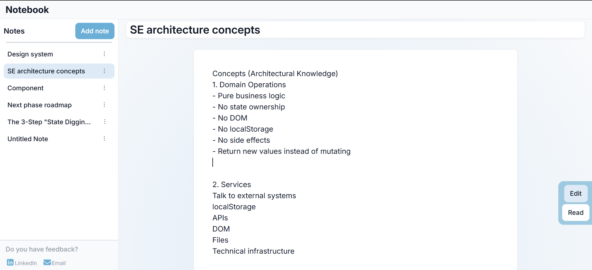
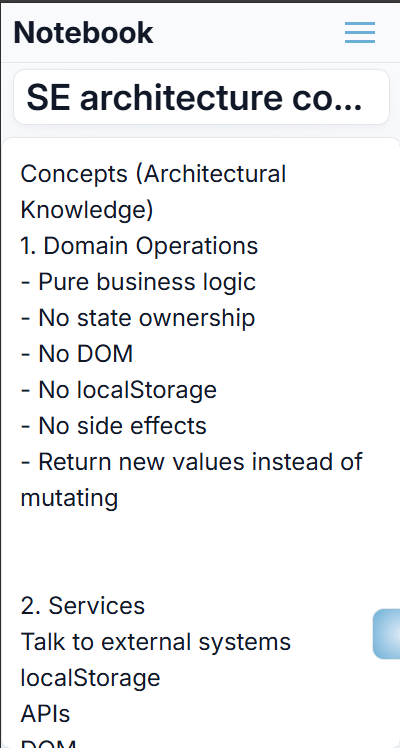

# Notebook App

A simple note-taking app built using only HTML, CSS and vanilla JavaScript.

The goal of this project is to learn the software engineering architectural patterns that modern frameworks and libraries do behind the scenes.

<p align="center">
  
  
</p>


## Features
- Edit and persist contents
- Switch between edit and read-only mode
- Sidebar - for note navigation
- Hamburger menu - to show and hide sidebar
- Title editor - used to update titles
- Content editor - enables to edit and paste
contents


## Architecture
*Design System*
- Tokens
- Components

*ES6+ Modules*
- State
- Domain
- Use cases
- Services
- Side effects
- Events
- UI


## Folder Structure

```
notebook-app
├── README.md
└── src
    ├── app.js
    ├── assets
    │   └── images
    │       ├── notebook-d.png
    │       └── notebook-m.png
    ├── design-system
    │   ├── base.css
    │   ├── components
    │   │   ├── active-section.css
    │   │   ├── button.css
    │   │   ├── delete-confirmation-popover.css
    │   │   ├── editor.css
    │   │   ├── empty-editor-card.css
    │   │   ├── index.css
    │   │   ├── menu-button.css
    │   │   ├── note-card.css
    │   │   ├── notice.css
    │   │   ├── sidebar-footer.css
    │   │   └── toolbar.css
    │   ├── index.css
    │   ├── layout
    │   │   ├── app.css
    │   │   ├── editor.css
    │   │   ├── empty-editor-card.css
    │   │   ├── hamburger-menu.css
    │   │   ├── index.css
    │   │   ├── note-card.css
    │   │   ├── sidebar-footer.css
    │   │   └── sidebar.css
    │   └── tokens
    │       ├── color.css
    │       ├── index.css
    │       ├── shape.css
    │       ├── size.css
    │       ├── spacing.css
    │       └── typography.css
    ├── domain
    │   ├── draft-actions.js
    │   └── note-actions.js
    ├── events
    │   ├── editorEvents.js
    │   ├── sidebarEvents.js
    │   └── toolbarEvents.js
    ├── index.html
    ├── services
    │   └── storage.js
    ├── side-effects
    │   └── sideEffects.js
    ├── state
    │   └── state.js
    ├── ui
    │   └── ui.js
    └── use-cases
        └── use-cases.js
  ```

>## Tech Stacks
> - HTML
> - CSS3
> - Vanilla JavaScript(ES6+)
> - Local Storage

&ensp;

## Future Architecture Progress
- A single getway mutation
- Appy subscription
- State change publication

## What I learned
- Three categories of data in a software system - *constant*, *state* and *derived*
- Boundaries between modules
- Single responsibility of components and modules
- State ownership - no state mutations outside state module
- Folder organization - separating source codes, documentation and dependencies


## Who can use it
- Anyone who wants to make notes and keep summary of what they study and read

&ensp;

> ### How to run
- Since it was totally built without any dependencies, you can use the following link to visit the demo.

&ensp; &ensp; &ensp; &ensp;Live Demo:  [Notebook app](https://teshomedev.github.io/notebook-app/)

&ensp;
> # My Goal
>  To become a software engineer by understanding the enginerring principles behind modern frontend frameworks instead of relying on abstraction.

&ensp;
&ensp;

> ### Contact
> [LinkedIn](http://www.linkedin.com/in/teshome-bekele-833a412aa)
\
\
[Email](mailto:teshomebf@gmail.com)


